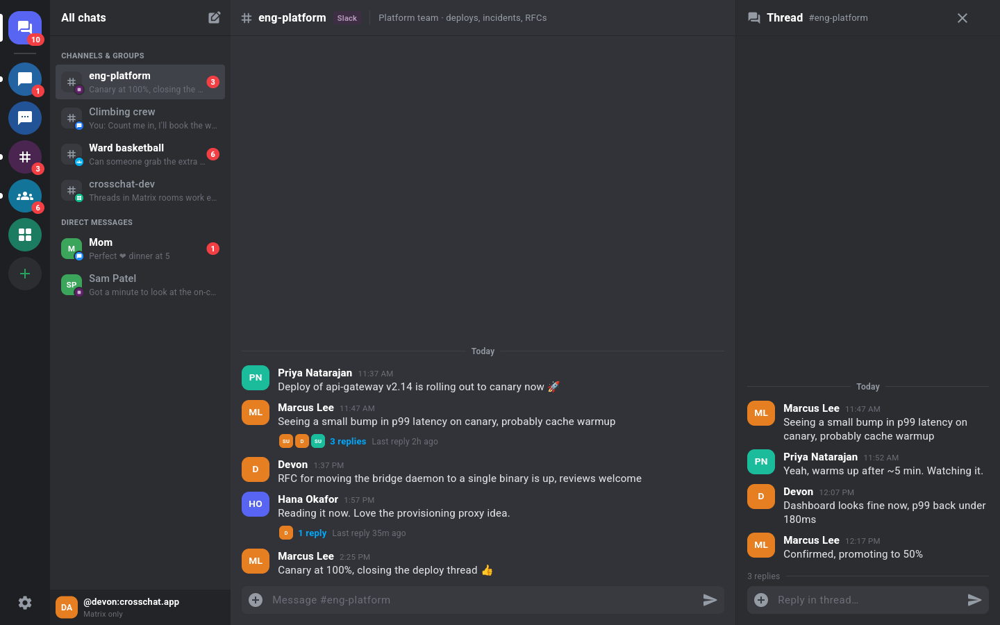

# Crosschat

**Open-source, self-hostable, native Beeper alternative built on Matrix.**

Crosschat is a Slack/Discord-style chat app that puts iMessage, RCS/SMS (Google Messages), Slack and GroupMe in one inbox. You run it on your own server:

- A **Rust core** ([matrix-rust-sdk](https://github.com/matrix-org/matrix-rust-sdk)).
- A **Flutter UI** via flutter_rust_bridge, with no Electron.
- A small daemon, **`crosschatd`**, that downloads, configures and supervises the unmodified upstream bridges.

> ⚠️ **Alpha.** Good for developers and tinkerers. Expect breaking changes. Nothing here has been tested with real iMessage, Google, Slack or GroupMe accounts yet.



## What works in the alpha

| Area | Status |
|---|---|
| **Rust core** (`crates/crosschat-core`) | Password login, session restore, a classic `/sync` loop with live updates, room list with network detection (`m.bridge`) and thread capability (`com.beeper.room_features`), timeline with **Matrix threads** folded into root summaries, thread panel via `/relations`, markdown sending, thread replies, user directory, DMs and groups. |
| **Daemon** (`crates/crosschatd`) | Manifest-driven bridge install: prebuilt binaries only (upstream releases, or Crosschat's `prebuilt-v1` release where upstream has none), every one SHA-256 pinned. Nothing is compiled on users' machines. Config generation (bridge `-e` output + template + managed secrets), appservice registrations, token vault, process supervision with backoff and restarts, health polling, bridge status endpoint, **bundled Tuwunel** (federation must be chosen explicitly). |
| **Provisioning proxy** | `/_crosschat/v1/...`, authenticated with your Matrix token: the bridgev2 provisioning API for in-app logins, plus a **cross-network contact search** fan-out (`search_users` + `resolve_identifier`). |
| **Bridges** | Manifests for **iMessage** ([corten-matrix](https://github.com/lrhodin/corten-matrix)), **Google Messages** ([mautrix-gmessages](https://github.com/mautrix/gmessages)), **Slack** ([mautrix-slack](https://github.com/mautrix/slack)) and **GroupMe** ([beeper/groupme](https://github.com/beeper/groupme), early). All four ran live under `crosschatd` on Linux and returned their real login flows through the proxy. |
| **First-run setup** | **No homeserver needed:** the desktop app (macOS, Linux) offers *Start a new server on this computer* (default) or *Use an existing Matrix server*. The first starts `crosschatd local` with a bundled Tuwunel on `localhost`, creates your owner account and signs you in; later launches reuse it. Plug and play: no Go, Rust, Xcode or compiler needed. Tuwunel and the default bridges ship inside the app (or are downloaded prebuilt). |
| **App** (`app/`) | Network rail, chat sidebar, dense message list, composer, **Slack-style thread side panel** (pushed routes on phones), and a new-chat dialog that searches bridges through crosschatd and falls back to Matrix users. **Generic bridgev2 login renderer**: forms, QR, code, emoji, **cookies via an embedded sign-in window** (paste as a fallback), complete. Settings with the bridge list and the **Android "keep connection open"** foreground-service toggle. Capability flags such as macOS-only iMessage key extraction. Demo mode. |
| **Tests** | 65 daemon tests (unit, HTTP proxy against a fake bridge, local-mode owner bootstrap against a fake homeserver), 9 core unit tests, 26 Flutter tests, an **end-to-end smoke test** against a real local Tuwunel with a real bridge (`scripts/smoke.sh`), and a **desktop integration test** of the whole new-server flow (`app/integration_test/`). |

## What doesn't work yet

- **No real-account logins have been tried.** Cookie logins (Google, Slack) open a private sign-in window (macOS: WKWebView; Linux: WebKitGTK 4.1 if installed). Sign in there and it closes by itself; for Google Messages you then tap the matching emoji on your phone. Where the window isn't available (Android for now, or Linux without `libwebkit2gtk-4.1-0`), and under **Advanced: paste cookies** everywhere, you can still paste a cURL command, Cookie header or JSON.
- The **iMessage hardware-key extractor** button calls the upstream CLI on macOS, but it is untested: there's no Mac in CI.
- No E2EE verification or recovery UI. No media, reactions, read receipts, typing or rich-text rendering (messages show their plain `body`).
- Classic `/sync` only, no sliding sync yet. No encrypted store or keychain: `session.json` is saved with mode 0600.
- Android persistent sync keeps the process alive, but the sync loop lives in the activity's engine, so swiping the app away stops it.
- No push notifications. Push is planned for a paid tier.
- The local server is **for this computer only** (`server_name` is `localhost`, no federation, loopback only): your phone can't reach it, and moving to a real domain later is a migration, not a rename ([#1](https://github.com/devonkinghorn/crosschat/issues/1)). No Docker image, reverse-proxy recipes or federation/server-name wizard for a real server yet.
- No UI yet to enable more bridges on the local server: edit `crosschatd.toml` in its data directory (below) and restart. **iOS and Windows builds are untested** (CI has a macOS job, but it isn't active yet; see below).
- WhatsApp, Signal and Telegram are not included yet. They'll be new manifests later. There is no BlueBubbles support.

## Layout

```
crates/crosschat-core   Rust client core (matrix-sdk 0.19)
crates/crosschatd       host daemon: manifests, installer, vault, supervisor, proxy, bundled HS
app/                    Flutter app; app/rust = flutter_rust_bridge crate (crosschat_ffi)
manifests/              bridge manifests (crosschat.bridge/v1)
deploy/                 example crosschatd.toml
scripts/smoke.sh        end-to-end test against a local Tuwunel
docs/ARCHITECTURE.md    design, decisions, risks
```

## Quick start: everything on this computer

You don't need a Matrix homeserver. Build the daemon and run the desktop app:

```bash
cargo build --release -p crosschatd
cd app && flutter run -d macos     # or: flutter run -d linux
```

On first launch pick **Start a new server on this computer**, choose a username and password, and click **Create server**. The app then:

1. starts `crosschatd local --dir <data>/server` **detached**, so bridges keep running after you close the window,
2. finds or installs Tuwunel (see below) and starts it on `127.0.0.1:6167` with `server_name = "localhost"` and federation off,
3. installs the enabled bridges (Google Messages and Slack by default): the copies bundled in the app, otherwise prebuilt downloads,
4. creates your account (`@you:localhost`, the server's first user and admin) with the server's private registration token,
5. signs you in. crosschatd is at `http://127.0.0.1:29300`.

Later launches start or reuse the same server and restore your session without asking. **Use an existing Matrix server** is the regular login form.

> `server_name` is permanent in Matrix. The local server is for this computer only: no federation, and phones can't reach it. Moving to a real domain later means re-backfilling bridged chats (see [#1](https://github.com/devonkinghorn/crosschat/issues/1)).

**Where things live**

| | macOS | Linux |
|---|---|---|
| App data (`matrix/` session + store, `server/`) | `~/Library/Application Support/Crosschat` | `$XDG_DATA_HOME/crosschat` (`~/.local/share/crosschat`) |
| Local server (`crosschatd.toml`, `local.json`, `crosschatd.log`, `data/`) | `…/Crosschat/server` | `…/crosschat/server` |
| Tuwunel download cache (if not bundled) | `~/Library/Caches/Crosschat/tuwunel-v1.9.3/bin/tuwunel` | `~/.cache/crosschat/tuwunel-v1.9.3/bin/tuwunel` |
| Downloaded bridges (if not bundled) | `…/Crosschat/server/data/bin/<id>/<version>/` | `…/crosschat/server/data/bin/<id>/<version>/` |

`crosschatd.toml` in the server directory is generated once and is yours to edit (e.g. `[bridges.imessage] enabled = true`). Then use **Settings → Server on this computer → Restart server**. To stop it entirely: `kill $(cat …/server/crosschatd.pid)` (it stops Tuwunel and the bridges too); the app starts it again on the next launch.

**How the app finds the binaries**

Users never compile anything. Every binary is prebuilt and SHA-256 pinned:

- **crosschatd:** `$CROSSCHATD_BIN`, then next to the app executable (`crosschat.app/Contents/MacOS/crosschatd`, or the Linux bundle directory), then `target/release/crosschatd` / `target/debug/crosschatd` in the source checkout the app was built from, then `$PATH`.
- **Tuwunel** (pinned to v1.9.3, resolved by crosschatd): `$TUWUNEL_BIN`, then `homeserver.bundled.binary`, then a `tuwunel` next to `crosschatd` (bundled in the app), then the cache. If none exist, crosschatd downloads it into the cache and checks the pinned SHA-256. On **Linux** that's the upstream release. On **macOS**, where upstream ships no binaries, it's Crosschat's [`prebuilt-v1`](https://github.com/devonkinghorn/crosschat/releases/tag/prebuilt-v1) build of the same tag (arm64 and x86_64, macOS 12+). `crosschatd install-tuwunel` does this ahead of time.
- **Bridges:** `bridges/<id>/<version>/` next to `crosschatd` (bundled in the app), otherwise a prebuilt download into the server's `data/bin/`.
  - Linux gmessages/slack and corten-matrix (iMessage) come from their upstream releases.
  - The macOS gmessages/slack builds and GroupMe (no upstream releases) come from `prebuilt-v1`. Upstream's darwin mautrix binaries link Homebrew's `libolm`, which Homebrew dropped, so these are built from the same tags with the pure-Go olm (`-tags goolm`) and depend only on system libraries (macOS 13+).
- **Making a self-contained app:** `scripts/bundle-local-server.sh [APP]` copies crosschatd, Tuwunel and the default bridges (Google Messages, Slack) into a built app, so first run is offline and instant. It adds about 130 MB on macOS arm64 (Tuwunel 80 MB, the two bridges 43 MB, crosschatd 10 MB). Optional bridges download when enabled.
- **Making the prebuilt binaries** (maintainers only): `scripts/build-prebuilt.sh` builds every `prebuilt-vN` asset from unmodified upstream source at the pinned tags/commits (Go + Xcode tools + rustup on a Mac for darwin, Go + zig for Linux). Then attach the assets to a new pre-release and update `prebuilt/SHA256SUMS`, the manifests and `tuwunel.rs`; a test checks they agree. CI can do the same: dispatch `ci/github-actions-ci.yml` with `prebuilt_tag`.
- **Developer source builds:** `CROSSCHAT_ALLOW_SOURCE_BUILDS=1` lets crosschatd build `go-build` manifests (needs Go), and fall back to `cargo install` for Tuwunel on macOS. `crosschatd install-tuwunel --from-source` forces the Tuwunel build. Off by default.
- **Overrides:** `CROSSCHAT_HOME` (env, or `--dart-define=CROSSCHAT_HOME=…`) moves all app data, e.g. for a throwaway test profile. `CROSSCHAT_CACHE_DIR` moves the Tuwunel cache.

`crosschatd local` works without the app too: `crosschatd local --dir ~/crosschat-server`, then `GET http://127.0.0.1:29300/_crosschat/v1/local/status` and `POST /_crosschat/v1/local/owner` with the token from `data/admin.token`.

## Running it on a server

Requirements:
- **Rust** ≥ 1.96 (`rustup`).
- **Flutter** 3.47+.
- **For Linux desktop builds:** `clang cmake ninja-build pkg-config libgtk-3-dev`.

### 1. The daemon (on your server)

```bash
cargo build --release -p crosschatd
cp deploy/crosschatd.example.toml crosschatd.toml   # set server_name, admins, enabled bridges
./target/release/crosschatd validate manifests
./target/release/crosschatd run -c crosschatd.toml
```

- **Existing homeserver:** registrations are written to `data/registrations/`. Add them to your homeserver (e.g. Synapse `app_service_config_files`) and restart it. Tuwunel can load them from a directory: `registration = { kind = "directory", path = ... }`.
- **Bundled Tuwunel:** fill in `[homeserver.bundled]`. You must set `federation = true|false` explicitly. `server_name` can't be changed later.
- **Reverse proxy:** expose crosschatd on your homeserver's domain at `/_crosschat/`. The bridges stay on loopback.

Bridges are **downloaded from upstream at install time** and are never vendored. They are AGPL-3.0, except corten-matrix, which is MPL-2.0.

### 2. The app

```bash
cd app
flutter pub get
flutter run -d linux                                      # real Rust core: log in to any Matrix homeserver
flutter run -d linux --dart-define=CROSSCHAT_DEMO=true    # demo data, no server needed
flutter build linux                                       # or: flutter build apk
CROSSCHAT_DEMO=1 build/linux/x64/release/bundle/crosschat # demo mode for an already-built binary
```

By default the app looks for crosschatd at your homeserver URL. You can change it under Settings → Networks, e.g. `http://127.0.0.1:29300`. Without crosschatd the app still works as a plain Matrix client.

### Android

The APK embeds the **real Rust core**: cargokit cross-compiles `crosschat_ffi` for each Android ABI with the NDK. Demo mode is only used with `--dart-define=CROSSCHAT_DEMO=true`, or if the native library fails to load.

```bash
# Prerequisites
# - Android SDK with platforms;android-36, build-tools;36.0.0, ndk;28.2.13676358
#   (Gradle fetches CMake itself)
# - JDK 17+
rustup target add aarch64-linux-android armv7-linux-androideabi x86_64-linux-android
cd app
flutter build apk --release --split-per-abi --target-platform android-arm64   # ~70 MB, most phones
adb install build/app/outputs/flutter-apk/app-arm64-v8a-release.apk
```

Notes:
- **Set `JAVA_HOME`** to your JDK directory, not `/usr`. Flutter puts `$JAVA_HOME/bin` first on Gradle's `PATH`. If that's `/usr/bin` and your distro ships an old `/usr/bin/rustc`, the NDK build picks up the wrong compiler.
- **Signing.** Release builds are signed with the debug key, so they're fine for sideloading but not for the Play Store.
- **Persistent sync.** Enable it under Settings → Background sync. It shows an ongoing notification. On Android 13+ the app asks for notification permission.

### macOS (step by step)

> Built and run on macOS 15 (Apple silicon) with Homebrew Flutter 3.47 and Xcode 26, including the new-server flow. iOS is untested.

**Build gotchas (read first):**
- **Put `/usr/bin` first on `PATH`.** A Nix-installed `gcc` (or Homebrew's) can shadow Apple clang as `cc` and break Rust crates with C/C++ code (RocksDB in Tuwunel, cargokit's build of the Rust core). Use `export PATH="/usr/bin:/bin:/usr/sbin:/sbin:/opt/homebrew/bin:$HOME/.cargo/bin:$PATH"`.
- **Don't set `CC`, `CXX` or `AR`.** Xcode 26 then fails `flutter build macos` with `clang: error: conflicting deployment targets, both '26.2' and '26.2' are present in environment`. Run `unset CC CXX AR` if your shell sets them.
- The app needs Dart ≥ 3.13.0 (`pubspec.yaml`); Homebrew's Flutter 3.47.5 ships Dart 3.13.4.
- crosschatd's macOS Tuwunel build already applies both fixes to its own `cargo install`.

1. **Xcode.** Install it from the App Store, then run:
   ```bash
   sudo xcode-select -s /Applications/Xcode.app/Contents/Developer
   sudo xcodebuild -license accept
   xcodebuild -runFirstLaunch
   ```
2. **Homebrew tools.** Flutter and CocoaPods (some Flutter plugins still use it). Go is not needed: bridges and Tuwunel are prebuilt.
   ```bash
   /bin/bash -c "$(curl -fsSL https://raw.githubusercontent.com/Homebrew/install/HEAD/install.sh)"
   brew install --cask flutter
   brew install cocoapods
   flutter doctor            # Xcode and macOS should be ✓
   ```
3. **Rust** (≥ 1.96), with both Mac targets so universal release builds work:
   ```bash
   curl --proto '=https' --tlsv1.2 -sSf https://sh.rustup.rs | sh -s -- -y
   source "$HOME/.cargo/env"
   rustup update stable
   rustup target add aarch64-apple-darwin x86_64-apple-darwin
   ```
4. **Clone and test:**
   ```bash
   git clone https://github.com/devonkinghorn/crosschat.git
   cd crosschat
   cargo build && cargo test
   ```
5. **Run crosschatd** on the Mac. Usually you don't need to: the app's **Start a new server on this computer** runs `crosschatd local` for you (see Quick start). For a hand-configured daemon:
   ```bash
   cargo build --release -p crosschatd
   cp deploy/crosschatd.example.toml crosschatd.toml
   # edit: [homeserver] url + server_name, [auth] admins = ["@you:your.server"], enable bridges
   ./target/release/crosschatd validate manifests
   ./target/release/crosschatd run -c crosschatd.toml
   ```
   crosschatd downloads Tuwunel and the bridges prebuilt (SHA-256 pinned): Tuwunel and the macOS mautrix bridges from Crosschat's `prebuilt-v1` release, and corten-matrix (iMessage) as published upstream. Nothing compiles.
6. **Run the app:**
   ```bash
   cd app
   flutter pub get
   flutter run -d macos                                    # real Rust core
   flutter run -d macos --dart-define=CROSSCHAT_DEMO=true  # demo data
   flutter build macos --release
   ../scripts/bundle-local-server.sh                       # self-contained .app (crosschatd, Tuwunel, bridges)
   open build/macos/Build/Products/Release/crosschat.app
   ```
   Set the crosschatd URL under Settings → Networks if it isn't served at your homeserver's `/_crosschat/` (e.g. `http://127.0.0.1:29300`).
7. **CI build instead.** The unsigned CI artifact (`crosschat-macos-unsigned.zip`) isn't notarized. After unzipping, run `xattr -dr com.apple.quarantine crosschat.app` before opening it.
8. **iMessage on a Linux host.** Download the upstream corten-matrix `extract-key` tool. Set its path in Settings (the macOS-only "iMessage hardware key" section). Then use **Extract from this Mac** in the iMessage login dialog. Turn **Contact Key Verification off** first.

The alpha macOS app is **unsandboxed** so it can run the extractor. It has the `network.client` entitlement.

### 3. Tests

```bash
cargo fmt --all --check && cargo clippy --workspace --all-targets -- -D warnings
cargo build && cargo test                       # unit + proxy tests (core smoke test skips without a server)
(cd app && flutter analyze && flutter test)

# Desktop end-to-end of the first-run flow with a throwaway profile:
# setup screen -> new local server (real crosschatd + Tuwunel) -> logged in
# -> relaunch reuses the server. Screenshots go to $CROSSCHAT_HOME/screenshots.
cargo build --release -p crosschatd
(cd app && flutter test integration_test/local_server_test.dart -d linux --dart-define=CROSSCHAT_HOME=/tmp/cc-e2e)   # or -d macos

# End-to-end. Starts a bundled Tuwunel via crosschatd, installs mautrix-gmessages,
# registers a user, runs the Rust core smoke test (login/send/threads/sync/restore),
# then checks bridge health and the provisioning proxy.
TUWUNEL_BIN=/path/to/tuwunel scripts/smoke.sh
SMOKE_BRIDGES="gmessages slack imessage groupme" TUWUNEL_BIN=... scripts/smoke.sh   # all four
```

CI covers Rust fmt/clippy/test, the end-to-end smoke test, Flutter analyze/test, a Linux build, an APK build, a macOS job (cargo test, `flutter build macos` and the bundling script, uploading the unsigned self-contained .app), and manual `prebuilt-*` jobs that rebuild the `prebuilt-vN` assets. The workflow lives in [`ci/github-actions-ci.yml`](ci/github-actions-ci.yml) and isn't active yet: the token that pushed this alpha lacked GitHub's `workflow` scope. To enable it, run `git mv ci/github-actions-ci.yml .github/workflows/ci.yml` and push with a token that has that scope.

## Network notes

- **iMessage** (corten-matrix): on a Linux host it needs an Apple hardware key, extracted **once on a Mac**. The macOS app can run the upstream extractor. **Contact Key Verification must be off** on your Apple ID.
- **iMessage (this Mac)** (mautrix-imessage's `mac` connector): no Apple ID sign-in and Contact Key Verification and SIP stay on. It reads the Messages app's database on the Mac running Crosschat and sends through Messages.app. Grant Crosschat **Full Disk Access** (System Settings → Privacy & Security) and allow it to **control Messages** when macOS asks. It can't send reactions, edits or unsend.
- **RCS/SMS** (Google Messages): Google-account cookie login. QR pairing no longer works. **Your Android phone must stay on and online.**
- **Slack:** an `xoxc-` token plus the `d` cookie (or email / Slack app).
- **GroupMe:** early. No upstream releases: Crosschat's `prebuilt-v1` carries builds of a pinned commit.

## Roadmap

1. **Daily-drivable:** E2EE verification and recovery, media, reactions, receipts, rich text, sliding sync, keychain storage.
2. **Logins without a terminal:** real-account testing of all four networks, the sign-in window on Android, a health screen.
3. **Real-server setup:** ✅ local server on this computer. Next: a wizard for a real server (server name, federation choice), migrating a local server to a real domain ([#1](https://github.com/devonkinghorn/crosschat/issues/1)), a Docker image, reverse-proxy recipes.
4. **Mobile:** sync loop inside the Android service, iOS, then an optional paid push tier and a ~$1/mo TLS-passthrough relay. The relay is documented only.
5. **More networks:** WhatsApp, Signal, Telegram.

See [docs/ARCHITECTURE.md](docs/ARCHITECTURE.md) for the design and the risks: bridge-host decryption, account bans, maintenance churn and onboarding.

## License

Crosschat is licensed under [Apache-2.0](LICENSE). Bridges and Tuwunel are separate upstream projects under their own licenses (AGPL-3.0, MPL-2.0, Apache-2.0). They are not vendored here: crosschatd downloads their prebuilt binaries, and the macOS app bundles the default ones. Binaries Crosschat builds itself (`prebuilt-v1`) come from unmodified upstream source; the release notes link the exact revisions.
