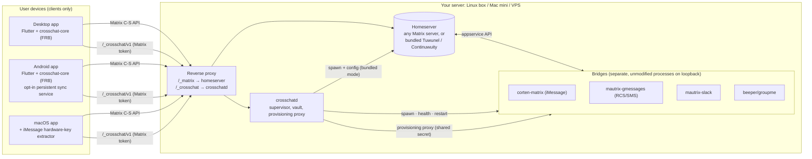

# Crosschat: architecture

*Formerly "Switchboard". Draft 3, Oct 7, 2026. Status markers: ✅ in the alpha, 🚧 partial, 📋 planned. ⚠️ marks unverified or uncertain items.*

Crosschat is an open-source, self-hostable, native alternative to Beeper. It's a Matrix client plus a host daemon that runs upstream bridges for you.

## 1. Goals and non-goals

**Goals**
- A unified inbox on Matrix with a **Slack/Discord-style UI**: a left rail of networks, a chat sidebar, a dense message list, and a Slack-style thread side panel.
- **Native, no Electron.** The core is Rust ([matrix-rust-sdk](https://github.com/matrix-org/matrix-rust-sdk)). The UI is Flutter, bound to Rust with [flutter_rust_bridge](https://github.com/fzyzcjy/flutter_rust_bridge), on Linux, macOS, Windows, Android, and iOS.
- **Any Matrix homeserver**, or a **bundled Tuwunel/Continuwuity** that Crosschat sets up. With the bundled server, federation is an explicit choice made at setup.
- **Turnkey bridges.** Unmodified upstream bridges, supervised by `crosschatd`, with logins done inside the app.
- **Device-specific features are first-class.** Some things only one platform can do, such as extracting the iMessage hardware key on a Mac. The app exposes these through capability flags instead of lowest-common-denominator features.

**Non-goals for v1**
- Our own Matrix engine or our own bridges.
- Calls, a web client, or multi-tenant hosting.
- Running bridges or a homeserver on phones.
- BlueBubbles. iMessage goes through corten-matrix only.
- WhatsApp, Signal, and Telegram. They come after the first four networks. Their bridges are bridgev2 too, so each is just a new manifest.

## 2. System overview

**One Rust workspace, three crates**

| Crate | Role | Status |
|---|---|---|
| `crates/crosschat-core` | Client facade over matrix-sdk 0.19: login and restore, sync, rooms, timeline, threads, send, user directory, DMs and groups. The only Matrix API Dart sees. | ✅ |
| `crates/crosschatd` | Host daemon: bridge manifests, installer, appservice registrations, token vault, supervisor, health, provisioning proxy, bundled homeserver. | ✅ |
| `app/rust` (`crosschat_ffi`) | flutter_rust_bridge 2.13 API over `crosschat-core`, with its own Tokio runtime and a `StreamSink` for updates. | ✅ |

**Why the split?** The homeserver *pushes* events to bridges over HTTP, and registering a bridge needs homeserver admin rights. So bridges must live where the homeserver can reach them, which rules out laptops and phones. Every device is just a Matrix client with its own device keys.

**Deployment modes**
- **Existing homeserver.** `crosschatd` manages the bridges only. Registrations are written to `data/registrations/`. For Synapse you add them to `app_service_config_files` and restart. Tuwunel can load them from an `appservice_dir` (`registration = { kind = "directory" }`).
- **Bundled homeserver.** `crosschatd` writes a Tuwunel config and runs it as a supervised child process, started before the bridges. `federation` has **no default**: the config refuses to load until you choose `true` or `false`. ✅ (Tuwunel). Continuwuity 📋.
- **Local (this computer only).** ✅ The desktop app's default first-run choice. It starts `crosschatd local`, which runs a bundled Tuwunel with `server_name = "localhost"`, federation off and loopback-only listeners, plus the bridges. See §4.3.
- **Client only.** The app logs in to any Matrix account without `crosschatd`. Bridge UI and contact search degrade gracefully.

## 3. Client core (`crosschat-core`)
- **SDK.** matrix-sdk 0.19.1 with sqlite stores, E2EE, and markdown. MSRV is Rust 1.96.
- **Sync.** ✅ The alpha runs a classic `/sync` loop (`sync_once` with backoff) and broadcasts `CoreEvent`s: `RoomsChanged`, `NewMessage`, `SyncState`. Classic sync works with any homeserver. 📋 Next: move to matrix-sdk-ui `RoomListService`/`Timeline` on Simplified Sliding Sync when the server supports it, and keep classic sync as the fallback.
- **Rooms.** ✅ The network comes from `m.bridge` or `uk.half-shot.bridge` state, with a fallback on the ghost-user prefix. Thread support comes from `com.beeper.room_features` (a `thread` level above 0 means supported).
- **Threads.** ✅ The main timeline folds `m.thread` replies into a summary on the root: reply count, latest reply, participants. The thread panel reads replies with the `/relations` API. Thread replies are sent as `m.thread` relations, with the reply fallback set to the latest event. Edits (`m.replace`) are applied.
- **Session.** ✅ `session.json` is stored with mode 0600, alongside the sqlite store. 📋 Move the token to the OS keychain and encrypt the store with a keychain-held passphrase.
- 📋 Verification, recovery, media, reactions, read receipts, typing indicators.

## 4. Host daemon (`crosschatd`)

### 4.1 What it does
1. Loads `crosschatd.toml` and the bridge manifests (`manifests/*.yaml`, schema `crosschat.bridge/v1`, `deny_unknown_fields`).
2. **Vault** (`vault.json`, 0600). Holds per-bridge `as_token`/`hs_token`, provisioning secrets, pickle keys, the double-puppet token, the admin token, and the homeserver registration token. Nothing in the vault is ever sent to clients.
3. **Install.** Downloads the pinned release from upstream and verifies its SHA-256: against `sha256sums.txt`, or against a sha256 pinned in the manifest. Writes are atomic. If neither checksum exists, it logs a loud trust-on-first-use (TOFU) warning. Bridges without releases are built from source at a **pinned commit** (`go-build`).
4. **Configure.** Runs the bridge's own `-e` to get its example config, deep-merges the manifest's `config:` template, then forces the managed keys: homeserver, appservice tokens, `127.0.0.1:<port>`, sqlite database, provisioning secret, double-puppet secret, permissions, and logging to stdout.
5. **Register.** Generates the registration with exclusive bot and ghost regexes and an escaped server name, plus a double-puppet appservice (`url: null`).
6. **Supervise.** Starts and stops processes (SIGTERM, then a kill after 10 s), with exponential backoff (1 s → 5 min, factor 2, reset after 2 min of uptime). A bridge is marked failed after 10 consecutive crashes. Logs go to a ring buffer and to `bridge.log`.
7. **Health.** Polls `/_matrix/mau/live` and `/ready`, and bridges POST per-login state to `/_crosschat/internal/bridge-status/{id}`.

### 4.2 API (`/_crosschat/v1`)
Clients authenticate with their **Matrix access token**. `crosschatd` validates it with `/account/whoami` and caches the result for 5 minutes, keyed by a hash of the token. Access is then checked against `auth.admins`, or all users on the server if `allow_server_users` is set.

| Route | Who | Purpose |
|---|---|---|
| `GET health` | public | liveness |
| `GET whoami` | user | who `crosschatd` thinks you are |
| `GET networks` | user | manifests with process state, health, capabilities, preflight checks, and requirements for this host OS |
| `POST search` | user | **contact search fan-out** across running bridges (bridgev2 `search_users`, plus `resolve_identifier` for phone numbers, emails, and handles), results merged and tagged by network |
| `GET contacts?bridge=` | user | bridgev2 `contacts` |
| `ANY bridges/{id}/provision/{v3/...}` | user | **provisioning proxy**: injects the shared secret and forces `user_id` to the caller, rejects path traversal and anything outside `v3/` |
| `POST bridges/{id}/{start,stop,restart}`, `GET bridges/{id}/logs` | admin | lifecycle |

**New chat.** The app searches through `POST /search`. Picking a result opens its existing DM room or calls `create_dm` through the proxy, then joins the portal. If `crosschatd` is unreachable, the dialog says so and falls back to the Matrix user directory. A hidden room with the bridge bot (`!gm pm +1555...`) is the last-resort fallback for bridges without the provisioning API 📋.

### 4.3 Local mode (`crosschatd local --dir <dir>`)
What the desktop app runs for **Start a new server on this computer**. Goal: Crosschat usable with no pre-existing homeserver.

- **Layout.** One directory (`~/Library/Application Support/Crosschat/server` on macOS, `$XDG_DATA_HOME/crosschat/server` on Linux): a generated, user-editable `crosschatd.toml` (`server_name = "localhost"`, `[homeserver.bundled] federation = false`, Tuwunel on `127.0.0.1:6167`, crosschatd on `127.0.0.1:29300`, Google Messages and Slack enabled), `local.json` (the owner), `crosschatd.log`, `crosschatd.pid`, and `data/`. Manifests are compiled into the binary and rewritten to `data/manifests` on each start. A config with federation on is refused.
- **Progress first.** Unlike `run`, the API binds *before* setup, so the app can poll `GET /_crosschat/v1/local/status` (`phase` = `starting`/`ready`/`failed`, a human-readable `detail`, `data_dir`, `owner`, URLs) while Tuwunel is installed and bridges are set up. Other routes answer 503 `CC_STARTING` until the daemon is ready, then everything is routed to the regular API. A second instance fails fast on the port.
- **Tuwunel binary** (`tuwunel.rs`, pinned v1.9.3): `$TUWUNEL_BIN` → `homeserver.bundled.binary` → `tuwunel` next to crosschatd (packaged app) → `<cache>/tuwunel-v1.9.3/bin/tuwunel`. Otherwise it installs into the cache: on Linux the upstream `.zst` release with a pinned SHA-256 (decompressed in-process with `ruzstd`); on macOS `cargo install --git … --tag v1.9.3 --locked` without the Linux-only `io_uring`/`systemd` features and without jemalloc, with `/usr/bin` first on `PATH` and `CC`/`CXX`/`AR` removed (Nix gcc breaks RocksDB). Upstream publishes no macOS binaries, and nixpkgs marks the darwin build broken. `$PATH` is not searched on purpose: another version could migrate the database.
- **Owner bootstrap.** `POST /_crosschat/v1/local/owner {username, password}`, authorized with the local admin token from `data/admin.token` (readable only by the user; the app reads it). It works once (409 `CC_OWNER_EXISTS` afterwards). It registers the account on Tuwunel through user-interactive auth with the vault's `m.login.registration_token` (plus `m.login.dummy` if asked), saves `local.json`, and adds the owner to the admins at runtime. Tuwunel makes its first account a server admin. Registration stays token-gated, so nothing else can sign up.
- **App side** (`app/lib/src/local/`). `ProcessLocalServer` finds crosschatd (`$CROSSCHATD_BIN` → next to the app executable → `target/{release,debug}` of the checkout the app was built from → `$PATH`), starts it **detached** so bridges outlive the window, reuses an already-running one if its `data_dir` matches (and refuses a foreign one), creates the owner and logs in with the Rust core. Later launches start or reuse it before restoring the session. Desktop only; phones see the option disabled with an explanation.
- **Limits.** `localhost` can't federate and phones can't reach it. `server_name` is immutable, so moving to a real domain is a migration: re-backfill bridged chats from the networks and re-import native rooms through an appservice with timestamp massaging (tracked as an issue).

### 4.4 Manifests
One YAML file per bridge. The sections are:
- `source`: `github-release` (artifacts per platform, checksums or pinned sha256) or `go-build` (repo, commit, tags).
- `process`: args and port.
- `registration`: bot and ghost localparts.
- `config`: deep-merge template.
- `login.flows`: hints for the UI.
- `capabilities`: `yes`/`no`/`unknown` per feature.
- `preflight`: blocking, warning, or info messages shown before login.
- `requirements`: things only some *client* platforms can provide. Each has `when_host`, `provided_by`, and `login_field`.
- `health`, `maturity`, `host_platforms`.

`crosschatd validate` checks every manifest. A unit test keeps the shipped manifests valid.

## 5. First networks

| Network | Bridge (upstream, downloaded at install) | Pin | Login | Notes |
|---|---|---|---|---|
| **iMessage** | [corten-matrix](https://github.com/lrhodin/corten-matrix) (MPL-2.0) | 1.3.2 (no checksums published → TOFU sha256 pinned) | `apple-id`; on Linux `external-key` (`hardware_key` field) | On a Linux host it needs an Apple **hardware key extracted once on a Mac**. The macOS app runs the upstream CLI extractor and pastes the result (capability `canExtractAppleHardwareKey`). **Preflight (blocking): Contact Key Verification must be OFF.** |
| **RCS/SMS** | [mautrix-gmessages](https://github.com/mautrix/gmessages) | v0.2609.0 | `google` (cookies) | **QR pairing is dead**: v0.2609.0 offers only the Google-account cookie flow (verified via the proxy). After cookies, you confirm an emoji on the phone. **The phone must stay powered on and online.** |
| **Slack** | [mautrix-slack](https://github.com/mautrix/slack) | v0.2609.1 | `token`: `xoxc-` token plus the **`d` cookie** (also `email`, `app`) | Slack threads map to `m.thread`. The Slack-style panel is the native experience. |
| **GroupMe** | [beeper/groupme](https://github.com/beeper/groupme) | built from source at `ff4fbcc` (`-tags goolm`) | `web`, `access-token` | **Early/alpha.** There are no releases. |

All four ran live under `crosschatd` on Linux in the alpha's smoke test, and each returned its real login flows through the proxy. No real account logins were tested.

**Thread degradation.** For rooms whose `com.beeper.room_features` doesn't declare threads (iMessage, RCS, GroupMe), "Reply in thread" and the thread panel are hidden. We never fake threads that wouldn't reach the other side.

## 6. App (Flutter)
- **Layout** ✅: rail (72 px) | sidebar (260 px) | channel | thread panel (380 px). On narrow screens (phones), the channel and the thread push as full-screen routes.
- **Screens** ✅: first-run setup (new local server, the default, or an existing server), login, room list with network filter and unread badges, timeline (dense, grouped, day dividers, thread summary rows), composer (Enter to send), thread panel and composer, new-chat dialog, settings, generic bridge login dialog.
- **Generic bridgev2 login renderer** ✅ covers every bridgev2 bridge with one component:
  - `user_input`: text, phone, password, token, select. `hardware_key` gets an "Extract from this Mac" button on macOS.
  - `display_and_wait`: QR (`qr_flutter`), pairing code, emoji, then a long-poll for the next step.
  - `cookies`: current bridgev2 `fields[].sources[]` shape (and the legacy `type`/`name` shape). Alpha: open the URL in a browser, then paste a cURL command, Cookie header, or JSON to fill the fields. 📋 An embedded, fresh, private webview that captures cookies automatically (`webview_flutter` on Android/iOS/macOS; Linux/Windows need another plugin).
  - `complete`.
- **Capability flags** ✅ (`PlatformCapabilities`): `canExtractAppleHardwareKey` (macOS), `hasPersistentSyncService` (Android), `hasEmbeddedWebview`, `isMobile`. Manifest `requirements.provided_by` is matched against the current platform.
- **Backends.** `FfiBackend` (Rust core) by default. `DemoBackend` (sample data) runs with `CROSSCHAT_DEMO=1` or `--dart-define=CROSSCHAT_DEMO=true`, and is used when the native library fails to load.

## 7. Notifications and mobile
- **Push is deferred to a paid tier.** It needs an operated push gateway (APNs and FCM keys belong to the app publisher), a privacy policy, and an iOS Notification Service Extension. 📋
- **Android: opt-in persistent sync** ✅ (alpha). Settings → "Keep connection open" starts a `remoteMessaging` foreground service with a minimum-importance ongoing notification, so the process and the Rust sync loop keep running in the background without push. ⚠️ Alpha limitation: the sync loop lives in the activity's Flutter engine, so swiping the app away stops it. 📋 Move the loop into the service. ⚠️ Behavior under deep Doze is unverified.
- **Future relay (documented only, not built).** A ~$1/mo **TLS-passthrough relay** for people without a public IP or Tailscale. It forwards raw TLS (SNI routing) to the user's home server, so the relay never sees plaintext or holds certificates. It would also be the natural home for the paid push gateway.

## 8. Security model
- The **host sees plaintext**: bridges decrypt Matrix events to re-send them to the remote network, and vice versa. This is inherent to bridging. Run the host on hardware you trust.
- **Appservice tokens** can impersonate everyone in their namespace. The **double-puppet token** can puppet *all* local users and is the most sensitive secret. Both live only in the vault.
- **Bridges bind to loopback.** Only `crosschatd` is exposed, through the reverse proxy, at `/_crosschat`. Clients never see provisioning secrets. The proxy always forces `user_id` to the authenticated caller.
- **Supply chain.** Versions are pinned and checksums verified. TOFU happens only where upstream publishes no checksums (corten-matrix), and is logged loudly. Source builds are pinned to a commit. 📋 Signed manifests.

## 9. Licensing
- **Our code is Apache-2.0.**
- **Bridges are never vendored.** `crosschatd` downloads the AGPL mautrix bridges and MPL corten-matrix from upstream at install time, and runs them unmodified as separate processes talking HTTP. If we ever ship them inside an image, we must ship the corresponding source for the exact tag or commit.
- Tuwunel and Continuwuity are Apache-2.0. matrix-rust-sdk is Apache-2.0. flutter_rust_bridge is MIT.

## 10. Risks and gaps
- **Scope.** Four networks, a daemon, a bundled homeserver, and five client platforms is a lot for a small team. Mitigations: bridgev2 everywhere, so one login renderer and one proxy cover all four; manifests instead of per-bridge code; a strict "no fake features" policy.
- **Bridge-host decryption.** See §8. It's unavoidable with bridges, and must be communicated clearly in onboarding.
- **Account bans and ToS.** Apple, Google, Slack, and GroupMe can flag or ban unofficial clients. iMessage via corten-matrix and Google Messages via cookies are the most fragile. The app shows maturity badges and preflight warnings.
- **Maintenance churn.** Upstream bridges, Google's cookie rotation, Apple's protocol changes, matrix-rust-sdk pre-1.0 APIs, and the bridgev2 provisioning API all move. Mitigation: pinned versions, a manifest per bridge, the end-to-end smoke test in CI-like scripts, and our facade crate as the only Rust API Dart sees.
- **Onboarding.** ✅ No homeserver needed to start: the local server on this computer. Still hard for a real server: reverse proxy, server name, federation choice. Plus a Mac for the iMessage key and cookie copy-paste on Linux. A real-server wizard, local-to-real migration and embedded webview logins are the biggest UX gaps 📋.
- **GroupMe** has no upstream releases and is early. iMessage has no published checksums.
- **Threads.** There is no standard "also send to channel" yet, and there is no cross-room thread inbox in the alpha.

## 11. Roadmap
1. **Alpha (this repo):** core, daemon, 4 manifests, Flutter UI, end-to-end smoke test, CI.
2. **Daily-drivable:** E2EE verification and recovery, media, reactions, read receipts, sliding sync, keychain storage, room list performance.
3. **Logins without a terminal:** embedded cookie webview, real-account testing of all four networks, a bridge health screen, logout and relogin.
4. **Setup wizard:** ✅ local server on this computer (owner bootstrap, server_name lock-in warning). 📋 Real-server flow (server name, federation choice), migrating a local server to a real domain, reverse proxy recipes, Docker image.
5. **Mobile:** sync loop in the Android service, iOS build, then the paid push tier and relay.
6. **More networks:** WhatsApp, Signal, Telegram.
